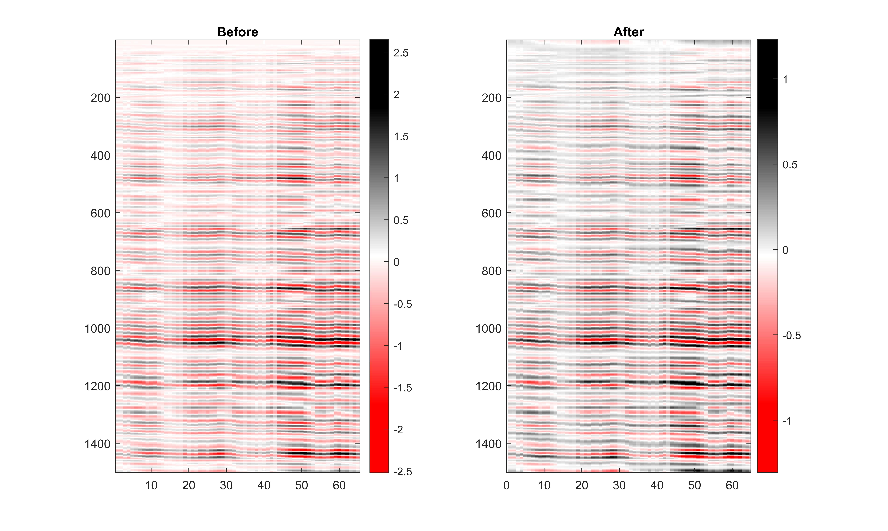
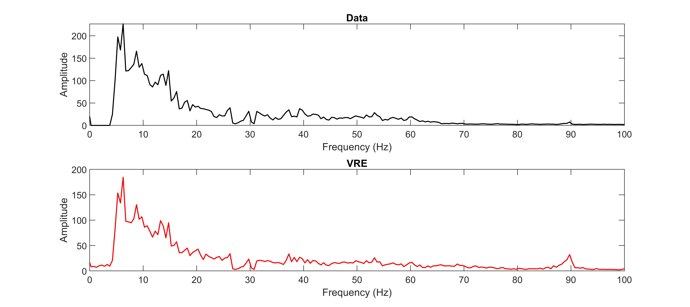
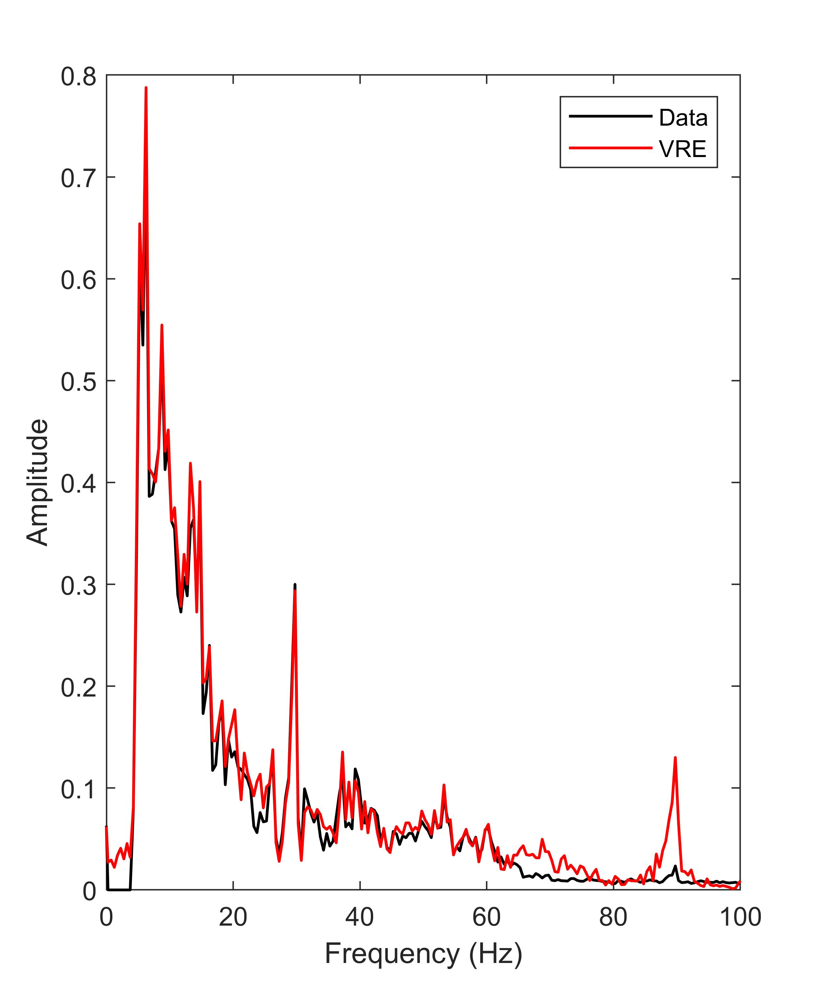

# VRE Seismic Enhancement

A compact, reproducible Python implementation of **Virtual Resolution Enhancement (VRE)** for seismic data, based on the method proposed by Rashed and Atef (2020) and implemented during my master's research in seismic data processing.

VRE is a nonlinear, moving-window amplitude transformation designed to sharpen seismic reflection events and improve their apparent temporal resolution while preserving polarity.

This repository preserves the numerical behavior of my original MATLAB implementation, removes memory-heavy intermediate arrays, and provides a cleaner Python implementation with a simple command-line workflow.

---

## Scientific context

Seismic resolution is limited by the bandwidth and shape of the recorded seismic wavelet. Closely spaced reflections may therefore appear broad or poorly separated, making interpretation more difficult.

**Virtual Resolution Enhancement (VRE)** was introduced by Rashed and Atef (2020) as a post-stack seismic enhancement technique. The method sharpens existing seismic events by modifying amplitudes locally within a moving window.

The basic principle is that amplitudes are normalized relative to a local extreme and then raised to a power greater than one. The largest amplitude in the window is preserved, while smaller surrounding amplitudes are reduced. This produces a narrower and sharper representation of the seismic event.

Positive and negative amplitudes are treated separately so that seismic polarity is retained.

VRE is an **enhancement method**: it sharpens information already present in the seismic section. It should not be interpreted as generating new reflections or recovering geological information that was absent from the original data.

### Original VRE publication

> Rashed, M. A., & Atef, A. H. (2020).  
> **Virtual resolution enhancement: A new enhancement tool for seismic data.**  
> *Open Geosciences, 12*, 363–375.  
> https://doi.org/10.1515/geo-2020-0169

This repository contains an independent implementation developed from the VRE experiment used during my master's work. It is not the original software distributed by the authors of the VRE paper.

---

## Method

For each seismic trace, the input signal is separated into non-negative and negative components.

Within each moving window, positive amplitudes are normalized by the local positive maximum and negative amplitudes by the local negative extreme.

The transformation used in the original implementation is:

```text
positive: y = max(x) * (x / max(x))^r
negative: y = min(x) * (x / min(x))^r
```

where `r` is the enhancement power.

For `r > 1`, normalized amplitudes smaller than the local extreme are reduced:

```text
0 < a < 1  ->  a^r < a
```

while the normalized extreme remains unchanged:

```text
1^r = 1
```

The effect is therefore to suppress amplitudes surrounding a local extreme more strongly than the extreme itself, producing a sharper seismic event.

Because the moving windows overlap, a sample can receive several estimates. The estimates from all windows containing that sample are averaged before the positive and negative components are recombined.

The operation is applied independently to every trace in the seismic section.

---

## Original implementation

The original MATLAB code used during the master's experiment is preserved in:

```text
VRE_3_original.m
```

The original experimental parameters are:

```text
window = 80
power  = 3
```

An important MATLAB indexing detail is preserved in the Python implementation: `window = 80` corresponds to an inclusive interval of **81 samples**, because both endpoints are included.

The number and positioning of moving windows are also kept consistent with the original implementation.

---

## Python implementation

The original MATLAB implementation creates large intermediate arrays while storing results from individual overlapping windows.

The Python implementation performs the same transformation without constructing the original `nt × nt × nx` intermediate arrays.

This substantially reduces memory requirements while preserving the numerical procedure used in the original experiment.

The implementation focuses on:

- preserving the original VRE calculation;
- reducing unnecessary memory allocation;
- making the algorithm easier to read and reuse;
- providing a reproducible command-line interface;
- preserving the original MATLAB script for reference and validation.

---

## Results

The following figures show results from the VRE experiment performed during my master's work.

### Seismic section before and after VRE



The figure compares the input seismic section with the section obtained after applying VRE.

The main reflector geometry is retained, while reflection events become sharper and more localized in time. This behavior results from the nonlinear suppression of lower-amplitude samples surrounding local extrema.

VRE does not generate new seismic events. It modifies the representation of reflections already present in the input section.

### Frequency spectra



The frequency-domain comparison shows how the nonlinear VRE transformation modifies the spectral content of the seismic section.

Sharpening seismic events in the time domain changes their spectral representation and can increase the relative contribution of higher-frequency components. Similar spectral changes were reported by Rashed and Atef (2020).

### Normalized spectrum



The normalized spectra make the relative spectral differences between the original and VRE-enhanced sections easier to compare.

The spectral broadening should be interpreted as a consequence of the nonlinear sharpening operation rather than as recovery of independently measured frequencies that were absent from the original seismic data.

Together, these results illustrate the intended behavior of VRE: sharpening existing seismic reflections while preserving the overall structure of the seismic section.

---

## Installation

Python 3.10 or newer is recommended.

### Linux / macOS

```bash
python -m venv .venv
source .venv/bin/activate
python -m pip install -e .
```

### Windows

```bash
python -m venv .venv
.venv\Scripts\activate
python -m pip install -e .
```

---

## Quick start

Run the self-contained synthetic example:

```bash
python examples/synthetic_example.py
```

Run the original experiment after placing `Section_GARCH.mat` in `data/`:

```bash
vre data/Section_GARCH.mat \
  --variable myfilter \
  --rows 0:700 \
  --columns 149:200 \
  --window 80 \
  --power 3 \
  --sample-interval 0.002 \
  --output results/original
```

The command writes the original and enhanced arrays to:

```text
vre_result.npz
```

and generates the corresponding seismic-section and spectral figures.

---

## Repository structure

```text
.
├── data/                  Instructions/location for local research data
├── examples/              Reproducible synthetic example
├── figures/
│   ├── before_after.jpg
│   ├── frequency_spectra.jpg
│   └── normalized_spectrum.jpg
├── src/vre/               Python implementation and command-line interface
├── tests/
│   └── test_core.py       Numerical and validation tests
├── .gitattributes
├── .gitignore
├── CITATION.cff           Software citation metadata
├── LICENSE
├── README.md
├── VRE_3_original.m       Original MATLAB research script
└── pyproject.toml         Package metadata and dependencies
```

---

## Numerical fidelity and corrections

The cleaned implementation deliberately preserves important numerical details of the original MATLAB code.

In particular:

- positive and negative amplitudes are processed separately;
- the same nonlinear power transformation is used;
- overlapping window estimates are averaged;
- `window = 80` corresponds to an inclusive span of 81 samples;
- the moving-window behavior follows the original implementation;
- the original power value of `3` is preserved as the default experimental setting.

The plotting code corrects the original frequency-axis construction by deriving frequency bins from the actual number of samples and the sampling interval.

This correction affects only the coordinates used for spectral visualization. It does **not** modify the VRE-enhanced seismic data.

The horizontal section axis is labelled as **trace number** because physical offset coordinates are not provided by the original script.

---

## Reproducibility

The original research dataset is not distributed with this repository because redistribution rights have not been established.

A small synthetic example is therefore included so that the VRE implementation can be run without access to the original data:

```bash
python examples/synthetic_example.py
```

Users who have access to the original MATLAB dataset can reproduce the original experiment by placing the data locally in the `data/` directory.

The original MATLAB script is retained in the repository so that the Python implementation can be compared directly with the research code.

---

## Limitations

- VRE is a nonlinear amplitude transformation.
- Results depend on the selected window length and enhancement power.
- Larger powers produce stronger suppression of amplitudes surrounding local extrema.
- The method modifies waveform shape and therefore also modifies the frequency spectrum.
- Spectral broadening should not automatically be interpreted as recovery of new geological information.
- VRE enhances existing seismic events rather than revealing reflections absent from the input data.
- The included experimental figures provide a qualitative demonstration rather than a general validation of performance.
- The original research data are not distributed because redistribution rights have not been established.

---

## Citation

The VRE methodology originates from:

> Rashed, M. A., & Atef, A. H. (2020).  
> **Virtual resolution enhancement: A new enhancement tool for seismic data.**  
> *Open Geosciences, 12*, 363–375.  
> https://doi.org/10.1515/geo-2020-0169

If you use the software from this repository, please also cite the repository using the metadata provided in `CITATION.cff`.

---

## License

The software in this repository is available under the MIT License.

The VRE methodology originates from Rashed and Atef (2020). The original research dataset and externally published material remain subject to their respective copyright and licensing terms and are not covered by this repository's software license.
